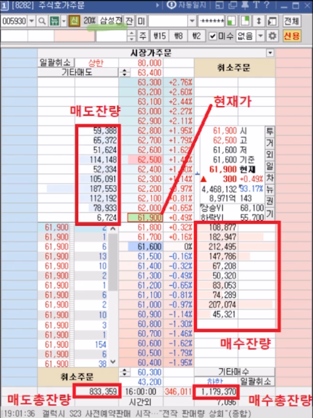
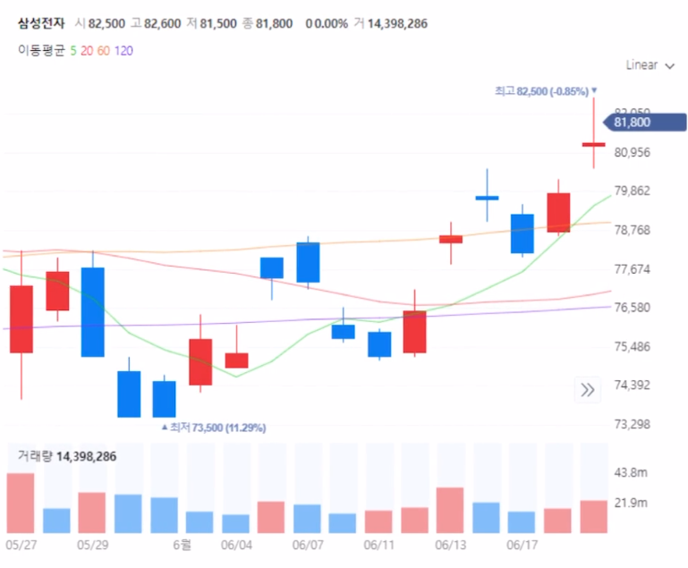

## 알고리즘 트레이딩
프로그래밍된 알고리즘이 시장 데이터를 분석해 특정 조건이 만족되면 자동으로 매도/매수를 실행하는 방식을 말한다. 

## 간단 주식 지식

### 1. 호가창
매수잔량, 매도잔량을 알 수 있다. 

아래의 이미지에서 61,900원에 팔고자 하는 사람이 6,724명, 61,800원에 사고자하는 사람이 108,877명으로 해석하면 된다.

### 2. 캔들

특정 분 단위로 주가의 변동을 보여주는 차트를 의미한다. (1분, 3분, 10분, 일봉)
- 시가: 시작 거래 가격
- 종가: 마지막 거래 가격
- 고가: 하루 거래 중 가장 비싸게 거래된 가격
- 저가: 하루 거래 중 가장 싸게 거래된 가격

시가보다 종가가 높으면 상승(빨간색), 낮으면 하강(파란색)으로 표시된다.

### 3. 이동 평균선
특정 기간동안 가격의 평균을 이어서 그린 선이다.

위의 이미지에서 초록선은 5개, 빨간선은 20개, 노란선은 60 그리고 보라선은 120개를 바탕으로 작성된다. 
"골드 크로스" 시점은 이 정보를 사용해 파악할 수 있다.

> 골드 크로스란?
> 
> 단기 이동평균선이 장기 이동평균을 돌파하는 시점으로 최근에 주가 상승이 가파르게 일어났다를 의미해, 이를 매수 신호로 해석한다.

## 트레이딩 구성요소

### 1. 데이터 수집

데이터는 트레이딩의 기초가 되는 매우 중요한 요소이다. 

자동화된 시스템을 통해 다양한 데이터를 수집 후 백테스팅/가격 예측에 활용할 수 있다.
- 캔들 데이터 - 시간, 고가, 저가, 종가, 거래량
- 틱 데이터 - 호가창에서 발생하는 모든 사건들에 대한 정보가 담겨 있는 데이터(호가정보, 체결 정보)
- 재무제표 데이터 - 기업에 대한 정보
- 기사 데이터

### 2. 전략 구축
- 초단타매매 - 사고 팔기를 빠른 속도로 반복하는 거래 방법
- 지표 기반 매매 - 이동평균선, RSI 등 다양한 지표를 활용하여 거래
- 머신러닝 기반 매매 - 다양한 input을 활용하여 주식의 상승/하락을 예측 후 거래(재무제표, 뉴스기사 활용)
- AI 기반 매매 - Chat GPT와 같은 LLM을 활용하여 투자

### 3. 백테스팅

특정 전략으로 과거에서부터 투자 했을 경우의 예상 수익률 계산하여 해당 전략의 효과를 테스트하는 과정이다. 이때, 데이터 과적합에 유의해야 한다. 백테스팅 후 실거래에 해당 전략을 사용하게 된다.

